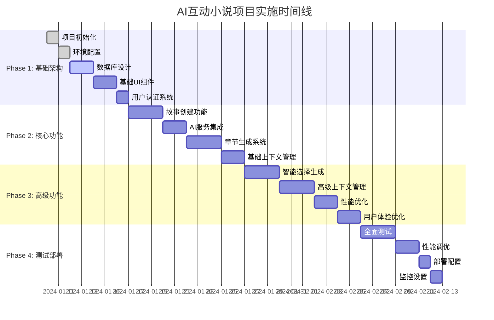

# AI互动小说项目实施计划

## 🎯 项目里程碑规划



## 📋 详细实施步骤

### Phase 1: 基础架构搭建 (7天)

#### Day 1: 项目初始化
```bash
# 1. 创建Next.js项目
npx create-next-app@latest ai-novel --typescript --tailwind --eslint --app

# 2. 安装核心依赖
npm install prisma @prisma/client zustand @tanstack/react-query
npm install framer-motion react-hook-form @hookform/resolvers zod
npm install @radix-ui/react-dialog @radix-ui/react-select

# 3. 安装开发依赖
npm install -D @types/node prisma
```

#### Day 2: 环境配置
- [ ] 配置TypeScript严格模式
- [ ] 设置ESLint和Prettier
- [ ] 配置TailwindCSS主题
- [ ] 设置环境变量模板
- [ ] 配置Git hooks

#### Day 3-4: 数据库设计
- [ ] 设计Prisma Schema
- [ ] 创建数据库迁移
- [ ] 设置PostgreSQL连接
- [ ] 配置Redis缓存
- [ ] 创建种子数据

#### Day 5-6: 基础UI组件
- [ ] 创建设计系统
- [ ] 开发基础组件 (Button, Input, Modal等)
- [ ] 实现响应式布局
- [ ] 添加动画效果

#### Day 7: 用户认证系统
- [ ] 实现JWT认证
- [ ] 创建登录/注册页面
- [ ] 设置中间件保护
- [ ] 用户状态管理

### Phase 2: 核心功能开发 (10天)

#### Day 8-10: 故事创建功能
```typescript
// 故事创建组件开发重点
interface StoryCreationFlow {
  step1: ThemeSelection;      // 主题选择
  step2: ProtagonistSetup;    // 主人公设置
  step3: StorySettings;       // 故事设置
  step4: InitialGeneration;   // 初始章节生成
}
```

**开发任务**:
- [ ] 主题选择界面 (都市/科幻/修仙/武侠)
- [ ] 主人公自定义表单
- [ ] AI主人公生成功能
- [ ] 故事设置配置
- [ ] 创建流程状态管理

#### Day 11-12: AI服务集成
```typescript
// AI服务架构
class AIServiceManager {
  private openaiService: OpenAIService;
  private claudeService: ClaudeService;
  private fallbackService: LocalService;
  
  async generateContent(prompt: string): Promise<string> {
    // 主服务 -> 备用服务 -> 本地服务
  }
}
```

**开发任务**:
- [ ] OpenAI API集成
- [ ] Claude API集成
- [ ] 提示词模板系统
- [ ] AI服务降级策略
- [ ] 响应格式标准化

#### Day 13-15: 章节生成系统
**开发任务**:
- [ ] 章节生成API
- [ ] 内容渲染组件
- [ ] 选择选项生成
- [ ] 用户输入处理
- [ ] 章节导航系统

#### Day 16-17: 基础上下文管理
**开发任务**:
- [ ] 故事上下文数据结构
- [ ] 上下文聚合算法
- [ ] 记忆存储机制
- [ ] 上下文压缩策略

### Phase 3: 高级功能开发 (10天)

#### Day 18-20: 智能选择生成
```typescript
// 选择生成算法
interface ChoiceGenerator {
  generateChoices(context: StoryContext): Choice[];
  evaluateChoiceImpact(choice: string): ImpactLevel;
  ensureChoiceDiversity(choices: Choice[]): Choice[];
}
```

**开发任务**:
- [ ] 智能选择算法
- [ ] 选择影响评估
- [ ] 选择多样性保证
- [ ] 自定义输入处理
- [ ] 选择历史追踪

#### Day 21-23: 高级上下文管理
**开发任务**:
- [ ] 向量数据库集成
- [ ] 语义相似度搜索
- [ ] 动态上下文调整
- [ ] 角色关系图维护
- [ ] 情节线索追踪

#### Day 24-25: 性能优化
**开发任务**:
- [ ] 数据库查询优化
- [ ] API响应缓存
- [ ] 前端代码分割
- [ ] 图片懒加载
- [ ] AI请求并发控制

#### Day 26-27: 用户体验优化
**开发任务**:
- [ ] 加载状态优化
- [ ] 错误处理改进
- [ ] 移动端适配
- [ ] 无障碍访问
- [ ] 用户引导系统

### Phase 4: 测试部署 (7天)

#### Day 28-30: 全面测试
```typescript
// 测试策略
interface TestStrategy {
  unit: ComponentTests;        // 组件单元测试
  integration: APITests;       // API集成测试
  e2e: UserFlowTests;         // 端到端测试
  performance: LoadTests;      // 性能测试
  ai: ContentQualityTests;    // AI生成质量测试
}
```

**测试任务**:
- [ ] 单元测试覆盖率 > 80%
- [ ] API集成测试
- [ ] 用户流程测试
- [ ] 性能基准测试
- [ ] AI生成质量测试

#### Day 31-32: 性能调优
**优化任务**:
- [ ] 数据库索引优化
- [ ] 缓存策略调整
- [ ] AI服务响应优化
- [ ] 前端性能调优
- [ ] 监控指标设置

#### Day 33: 部署配置
**部署任务**:
- [ ] Vercel部署配置
- [ ] 环境变量设置
- [ ] 数据库迁移
- [ ] CDN配置
- [ ] 域名绑定

#### Day 34: 监控设置
**监控任务**:
- [ ] 应用性能监控
- [ ] 错误追踪设置
- [ ] 用户行为分析
- [ ] AI使用监控
- [ ] 成本监控

## 🎯 关键成功指标 (KPI)

### 技术指标
- **响应时间**: API响应 < 2秒，AI生成 < 10秒
- **可用性**: 系统可用性 > 99.5%
- **性能**: 首屏加载 < 3秒
- **质量**: 代码覆盖率 > 80%

### 用户体验指标
- **生成质量**: AI内容质量评分 > 4.0/5.0
- **用户留存**: 7天留存率 > 30%
- **使用深度**: 平均故事章节数 > 5
- **满意度**: 用户满意度 > 4.2/5.0

## 🚨 风险管理

### 技术风险
| 风险 | 概率 | 影响 | 缓解策略 |
|------|------|------|----------|
| AI服务不稳定 | 中 | 高 | 多服务商备用方案 |
| 性能瓶颈 | 中 | 中 | 提前性能测试和优化 |
| 数据丢失 | 低 | 高 | 定期备份和容灾方案 |
| 安全漏洞 | 低 | 高 | 安全审计和渗透测试 |

### 业务风险
| 风险 | 概率 | 影响 | 缓解策略 |
|------|------|------|----------|
| AI成本过高 | 中 | 中 | 成本监控和优化 |
| 用户接受度低 | 中 | 高 | 用户测试和反馈收集 |
| 内容质量差 | 中 | 高 | 内容质量监控和改进 |
| 竞争对手 | 高 | 中 | 差异化功能和体验 |

## 📊 资源需求

### 人力资源
- **全栈开发**: 1人 (您)
- **设计支持**: 0.2人 (外包或工具)
- **测试支持**: 0.1人 (自动化为主)

### 技术资源
- **开发环境**: 本地开发 + GitHub
- **部署平台**: Vercel (免费额度)
- **数据库**: Supabase (免费额度)
- **AI服务**: OpenAI API ($50-100/月)
- **监控服务**: Vercel Analytics (免费)

### 预算估算
```
月度运营成本:
├── AI服务费用: $50-100
├── 数据库服务: $0-25 (免费额度内)
├── 部署服务: $0 (Vercel免费)
├── 监控服务: $0-20
└── 总计: $50-145/月
```

## 🎉 交付成果

### MVP版本功能
- ✅ 用户注册登录
- ✅ 故事主题选择
- ✅ 主人公自定义/AI生成
- ✅ AI章节生成
- ✅ 3选项 + 自由输入
- ✅ 基础上下文管理
- ✅ 故事保存和继续

### 技术文档
- ✅ 架构设计文档
- ✅ API接口文档
- ✅ 部署指南
- ✅ 用户手册

### 代码质量
- ✅ TypeScript严格模式
- ✅ 单元测试覆盖
- ✅ 代码规范检查
- ✅ 性能优化

---

*实施计划版本: v1.0*  
*预计完成时间: 34天*  
*最后更新: 2024-01-10*
